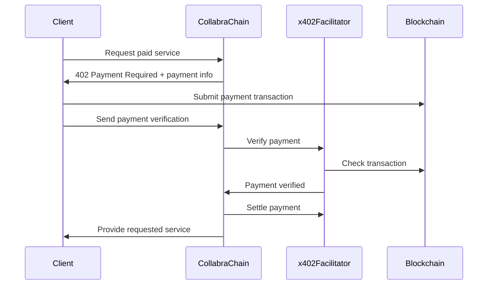

# x402 Payment Integration for CollabraChain

This document explains how to integrate [x402 payment standard](https://x402.gitbook.io/x402) with your CollabraChain platform to enable seamless crypto payments for various platform services.

## 🎯 **User Stories Implemented**

### 🤖 **AI-Assisted Project Creation**

- **Fee**: 1.00 USDC
- **Purpose**: Monetize AI service for complete project draft creation
- **Flow**: User pays → AI generates project with milestones → User receives complete project spec

### 📝 **Project Application Signal Fee**

- **Fee**: 0.50 USDC
- **Purpose**: Prevent spam applications and ensure serious candidates
- **Flow**: Freelancer pays → Application submitted → Creator reviews quality applications

### ✅ **Milestone Approval Service Fee**

- **Fee**: 2.00 USDC
- **Purpose**: Cover platform costs for payment processing and SBT minting
- **Flow**: Creator pays → Milestone approved → Payment released + SBTs minted

### ⚖️ **Dispute Resolution Bond**

- **Fee**: 10.00 USDC
- **Purpose**: Prevent frivolous disputes and compensate human arbiters
- **Flow**: Party pays → Dispute created → Arbiter assigned → Resolution

---

## 🏗️ **Implementation Guide**

### **1. Environment Setup**

Add to your `.env` file:

```bash
# x402 Payment Configuration
PLATFORM_WALLET_ADDRESS=0x742d35Cc6635C0532925a3b8D716C4C3e4d4Cc62
X402_FACILITATOR_URL=https://facilitator.x402.xyz
```

### **2. Integration with Express App**

```typescript
import express from "express";
import x402Router from "./api/x402-router.js";

const app = express();

// Mount x402 payment routes
app.use("/api/x402", x402Router);

app.listen(3000, () => {
  console.log("🚀 CollabraChain API with x402 payments running on port 3000");
});
```

### **3. Frontend Integration Examples**

#### **AI Project Creation**

```typescript
// Step 1: Request AI project creation (returns 402)
const response = await fetch("/api/x402/ai-project/request", {
  method: "POST",
  headers: { "Content-Type": "application/json" },
  body: JSON.stringify({
    userId: "user_12345",
    projectType: "DeFi Dashboard",
    requirements: "Modern UI with real-time data and mobile responsive",
  }),
});

if (response.status === 402) {
  const payment = await response.json();

  // Step 2: Show payment UI to user
  console.log("💰 Payment Required:", payment.payment);

  // Step 3: After user pays, verify payment
  const verifyResponse = await fetch("/api/x402/ai-project/process", {
    method: "POST",
    headers: { "Content-Type": "application/json" },
    body: JSON.stringify({
      paymentId: payment.payment.id,
      transactionHash: "USER_TRANSACTION_HASH",
    }),
  });

  const result = await verifyResponse.json();
  console.log("🎉 AI Generated Project:", result.project);
}
```

#### **Project Application**

```typescript
// Request to apply to project (returns 402)
const applyResponse = await fetch("/api/x402/application/request", {
  method: "POST",
  headers: { "Content-Type": "application/json" },
  body: JSON.stringify({
    userId: "freelancer_456",
    projectAddress: "0xproject123...",
    applicationMessage:
      "I have 5 years experience in React and smart contracts...",
  }),
});

if (applyResponse.status === 402) {
  const payment = await applyResponse.json();
  // Show payment UI...

  // After payment
  const processResponse = await fetch("/api/x402/application/process", {
    method: "POST",
    headers: { "Content-Type": "application/json" },
    body: JSON.stringify({
      paymentId: payment.payment.id,
      transactionHash: "USER_TRANSACTION_HASH",
    }),
  });
}
```

---

## 🔄 **x402 Payment Flow**

Based on the [x402 standard](https://x402.gitbook.io/x402), here's how payments work:



---

## 📊 **API Endpoints**

### **Payment Request Endpoints** (Return 402 Payment Required)

| Endpoint                        | Method | Purpose                     | Fee        |
| ------------------------------- | ------ | --------------------------- | ---------- |
| `/api/x402/ai-project/request`  | POST   | Request AI project creation | 1.00 USDC  |
| `/api/x402/application/request` | POST   | Apply to project            | 0.50 USDC  |
| `/api/x402/milestone/request`   | POST   | Approve milestone           | 2.00 USDC  |
| `/api/x402/dispute/request`     | POST   | Create dispute              | 10.00 USDC |

### **Payment Processing Endpoints** (After Payment)

| Endpoint                        | Method | Purpose                     |
| ------------------------------- | ------ | --------------------------- |
| `/api/x402/ai-project/process`  | POST   | Process AI project creation |
| `/api/x402/application/process` | POST   | Submit project application  |
| `/api/x402/milestone/process`   | POST   | Complete milestone approval |
| `/api/x402/dispute/process`     | POST   | Create dispute case         |

### **Utility Endpoints**

| Endpoint                       | Method | Purpose                 |
| ------------------------------ | ------ | ----------------------- |
| `/api/x402/payment/:paymentId` | GET    | Check payment status    |
| `/api/x402/pricing`            | GET    | Get pricing information |
| `/api/x402/health`             | GET    | Service health check    |

---

## 💰 **Payment Pricing**

```json
{
  "scenarios": {
    "AI_PROJECT_CREATION": {
      "amount": "1.00 USDC",
      "description": "AI-assisted project creation with complete draft and milestones",
      "duration": "Instant"
    },
    "APPLICATION_SIGNAL_FEE": {
      "amount": "0.50 USDC",
      "description": "Anti-spam signal fee for serious project applications",
      "duration": "Instant"
    },
    "MILESTONE_APPROVAL_FEE": {
      "amount": "2.00 USDC",
      "description": "Service fee for milestone approval and SBT minting",
      "duration": "Instant"
    },
    "DISPUTE_BOND": {
      "amount": "10.00 USDC",
      "description": "Dispute resolution bond with human arbiter assignment",
      "duration": "24-48 hours"
    }
  },
  "paymentMethods": ["USDC", "ETH"],
  "network": "Base",
  "facilitator": "x402.xyz"
}
```

---

## 🔒 **Security Features**

### **Payment Verification**

- All payments verified through x402 facilitator
- Transaction hash validation
- Amount and recipient verification
- Deadline enforcement (1 hour expiry)

### **Session Management**

- Secure payment session storage
- Automatic cleanup of expired sessions
- Request validation middleware

### **Error Handling**

- Comprehensive error logging
- User-friendly error messages
- Graceful failure recovery

---

## 🧪 **Testing**

### **Test Payment Flow**

```bash
# 1. Request AI project creation
curl -X POST http://localhost:3000/api/x402/ai-project/request \
  -H "Content-Type: application/json" \
  -d '{"userId":"test_user","projectType":"Web3 DApp","requirements":"Modern React app with wallet integration"}'

# Should return 402 with payment details

# 2. Check payment status
curl http://localhost:3000/api/x402/payment/PAYMENT_ID

# 3. Process payment (after user pays)
curl -X POST http://localhost:3000/api/x402/ai-project/process \
  -H "Content-Type: application/json" \
  -d '{"paymentId":"PAYMENT_ID","transactionHash":"TX_HASH"}'
```

### **Integration Testing**

```typescript
// Example Jest test
describe("x402 Payment Integration", () => {
  test("AI project creation payment flow", async () => {
    // Request payment
    const paymentResponse = await request(app)
      .post("/api/x402/ai-project/request")
      .send({ userId: "test", projectType: "DeFi", requirements: "Test" });

    expect(paymentResponse.status).toBe(402);
    expect(paymentResponse.body.payment).toBeDefined();

    // Mock payment verification
    const processResponse = await request(app)
      .post("/api/x402/ai-project/process")
      .send({
        paymentId: paymentResponse.body.payment.id,
        transactionHash: "mock_tx_hash",
      });

    expect(processResponse.status).toBe(200);
    expect(processResponse.body.success).toBe(true);
  });
});
```

---

## 🚀 **Next Steps**

1. **Integrate with Smart Contracts**: Connect the TODO comments in the code to your actual CollabraChain smart contracts
2. **Frontend UI**: Build payment UI components for seamless user experience
3. **Monitoring**: Add payment analytics and monitoring dashboards
4. **Scaling**: Consider caching and rate limiting for production
5. **Testing**: Comprehensive testing on Base testnet before mainnet deployment

---

## 📚 **Resources**

- [x402 Official Documentation](https://x402.gitbook.io/x402)
- [x402 Discord Community](https://discord.gg/x402)
- [Base Network Documentation](https://docs.base.org)
- [USDC on Base](https://developers.circle.com/stablecoins/docs/usdc-on-base)

---

## 🛠️ **Troubleshooting**

### **Common Issues**

1. **Payment Verification Fails**
   - Check transaction hash format
   - Verify payment amount matches expected
   - Ensure payment sent to correct recipient address

2. **Session Not Found**
   - Check if payment session expired (1 hour)
   - Verify payment ID format
   - Ensure session was created properly

3. **x402 Facilitator Errors**
   - Check facilitator URL configuration
   - Verify network connectivity
   - Review facilitator API documentation

### **Debugging**

```bash
# Enable debug logging
DEBUG=x402:* npm start

# Check payment service logs
tail -f logs/x402-service.log

# Monitor payment sessions
curl http://localhost:3000/api/x402/health
```
